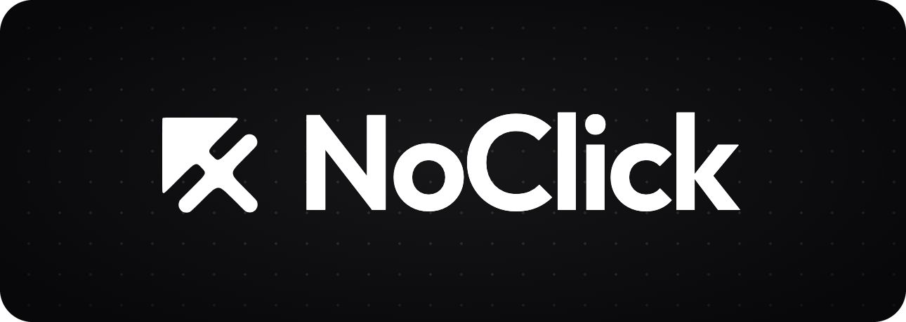
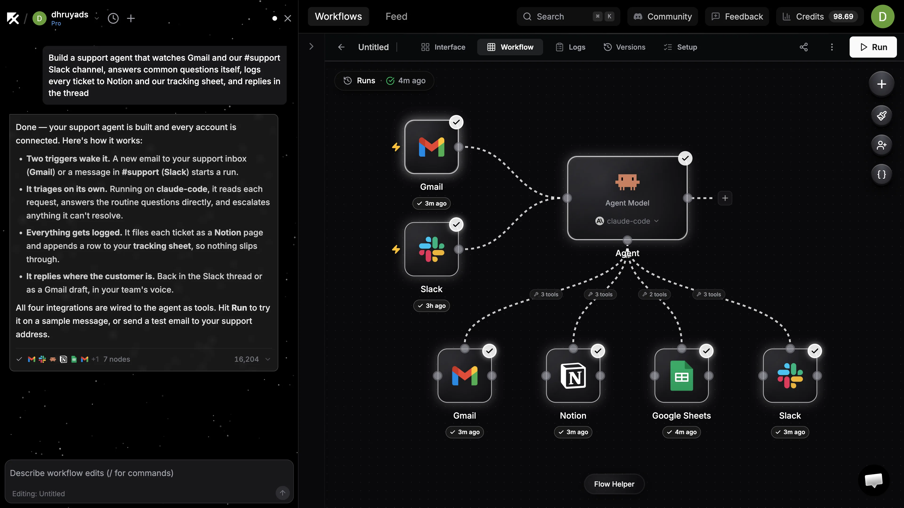

<p align="center">
  <a href="https://noclick.com">
    
  </a>
</p>

<p align="center">
  <strong>Describe an agent. Watch it get built. Let it run.</strong><br />
  Workflow automation with AI agents at the core — a visual canvas, ~160
  integrations, and coding agents that can actually use your tools.
</p>

<p align="center">
  <a href="https://noclick.com">Website</a> ·
  <a href="https://docs.noclick.com">Docs</a> ·
  <a href="./docs/self-hosting.md">Self-hosting</a> ·
  <a href="https://discord.com/invite/sHC2mrnss8">Discord</a> ·
  <a href="./CONTRIBUTING.md">Contributing</a>
</p>

<p align="center">
  <a href="https://www.npmjs.com/package/noclick"></a>
  <a href="https://pypi.org/project/noclick/"></a>
  <a href="https://discord.com/invite/sHC2mrnss8"></a>
</p>

<p align="center">
  <a href="https://railway.com/new/template/noclick?utm_medium=integration&amp;utm_source=button&amp;utm_campaign=noclick"></a>
  <a href="https://render.com/deploy?repo=https://github.com/noclickapp/noclick"></a>
  <a href="https://cloud.digitalocean.com/apps/new?repo=https://github.com/noclickapp/noclick/tree/main"></a>
</p>

<p align="center">
  <a href="https://noclick.com">
    
  </a>
</p>

## Quick start

Try NoClick with [npx](https://docs.npmjs.com/cli/v10/commands/npx) — requires
[Node.js](https://nodejs.org) 18+ and [Docker](https://docs.docker.com/get-docker/):

```bash
npx noclick
```

Or with one line of shell, no Node required:

```bash
curl -fsSL https://noclick.com/install.sh | sh
```

Or by hand — the same thing, visibly:

```bash
git clone https://github.com/noclickapp/noclick.git && cd noclick
./scripts/noclick-setup.sh
docker compose up -d
```

Each installer path fetches the source, generates this instance's secrets —
including the credential-encryption key, which is kept across re-runs — and
starts the stack with Docker Compose. Re-running updates in place. Releases are
tags; pin the exact source the installer builds with `NOCLICK_REF=v0.2.2`. The
installer deliberately builds that checkout locally. If you operate the Compose
stack directly, `NOCLICK_VERSION=0.2.11 docker compose up -d` instead pins the
released backend image; the frontend is still built for your public URLs. Every
installer option is documented at the top of [`install.sh`](./install.sh).

Then open the editor at [http://localhost:3000](http://localhost:3000).

---

## What is NoClick?

NoClick lets you build automations on a visual canvas and run them on triggers —
webhooks, schedules, inbound email, or chat messages from Slack, WhatsApp and
friends. What makes it different is the agent layer: an AI agent node can drive
real coding harnesses (Claude Code, Codex, opencode, hermes, OpenClaw) and call
your connected integrations as tools, so an agent can read a Linear issue, work
in a git repo, and post the result back to Slack.

This repository is the platform: the workflow engine, every integration node,
the React editor, the realtime collaboration layer, the AI workflow builder,
and an MCP server. It's the same code that runs [noclick.com](https://noclick.com).

<p align="center">
  
</p>

## What you can build

- **Automations on a canvas** — chain ~160 integrations (Slack, Gmail, Notion,
  Linear, HubSpot, Stripe, Postgres, Google Sheets, …) with branching,
  iteration, filters, and code nodes.
- **Triggers** — webhooks, cron schedules, inbound email, and app events from
  Slack/Discord/HubSpot; channel-style agents that reply where they're spoken
  to, with as many triggers per workflow as you need.
- **AI agents with real tools** — wire integration nodes into an agent's tool
  handle and it can call those operations directly. Agent nodes run either
  in-process (any OpenAI/Anthropic/OpenRouter-compatible model) or as a coding
  harness using your own installed CLI.
- **Interfaces** — publish a form, dashboard, or chat over any workflow.
- **Build with AI** — describe what you want and the builder assembles the
  workflow on the canvas. It's also exposed over MCP, so you can point Claude
  Code (or any MCP client) at your instance and have it build for you.

## How it works

1. **Describe it.** Type what you want into the builder — or point any MCP
   client at your instance and let your coding agent do the describing.
2. **The builder assembles it.** Nodes appear on the canvas wired to real
   operations, asking only for what it genuinely needs: credentials, and the
   choices only you can make.
3. **It runs on triggers.** A message arrives, a webhook fires, a schedule
   ticks — the workflow executes, agents call their tools, and results land
   where you told them to. Every run records its tool calls, timings, and the
   agent's response, so you can see exactly what happened.

## Self-hosting

The installer above is the fast path. For a real deployment — your own Postgres,
object storage, OAuth apps for integrations, model providers, and the
environment variables each side needs — read the
**[self-hosting guide](./docs/self-hosting.md)**.

The deploy buttons above ask for nothing: Railway and Render create a Postgres
database next to the reviewed release image (DigitalOcean binds a managed
cluster named `noclick-db` you create first), and the instance does the rest on
first boot — it runs its own auth layer, prepares the database, and generates
its own keys. Railway uses [`railway.template.json`](./railway.template.json),
Render [`render.yaml`](./render.yaml), DigitalOcean
[`.do/deploy.template.yaml`](./.do/deploy.template.yaml), and Fly
[`fly.toml`](./fly.toml). See the
**[hosted deployment guide](./docs/self-hosting.md#hosted-deployments)** for
what each one provisions and where its secrets live.

Releases are what you run: `main` moves with every upstream merge, tags are
deliberate cuts, and each tag publishes images to GHCR so the compose stack
pulls rather than builds. Pin with `NOCLICK_VERSION`.

## Developing from source

Prerequisites: Docker, the [Supabase CLI](https://supabase.com/docs/guides/cli),
Python 3.12 (3.13 isn't supported yet — some pinned wheels don't build on it),
Node.js 20 or newer, and pnpm 10.34.4 (or npm for running package scripts).

```bash
pip install -r requirements.txt
make local
```

That boots everything on your machine — a local Supabase (Postgres, auth,
storage), the backend, and the frontend — and prints a URL. Sign up with any
email; local auth confirms instantly. No cloud account, no API keys required to
get to a running canvas.

```bash
# Backend
cd backend && python server.py       # or: uvicorn server:web_app
pytest                               # test suite

# Frontend
cd frontend && npm run dev
npm run typecheck && npm run build && npm test

# Database migrations
cd infra && supabase migration up --local
```

## Architecture

| Path | What lives there |
|---|---|
| `backend/nodes/` | Every integration node — one module per service, self-describing config schemas |
| `backend/wss/` | Socket.IO event layer: handlers, typed events, the workflow execution engine |
| `backend/coder/workflow/` | The XML workflow DSL, graph state, and the AI builder |
| `backend/mcp_server.py` | MCP server exposing workflow construction to any MCP client |
| `backend/utils/` | Shared services: webhooks, credentials, storage, relay, cron |
| `frontend/app/` | Remix + Vite app: ReactFlow canvas, config panels, interface builder |
| `infra/supabase/` | Database migrations |
| `sdk/` | The `noclick` TypeScript SDK for embedding published workflows |

Node config UIs are generated from the backend's Pydantic models, so adding an
integration is mostly writing one Python module — the editor picks it up.

## NoClick Cloud

[noclick.com](https://noclick.com) is the hosted platform. It runs this engine
plus managed infrastructure: retained agent runtimes so turns resume instantly,
scaled webhook and cron delivery, additional hosted builder capabilities, and
managed storage and email. Self-hosted and cloud share the same workflow
format, so workflows move between them unchanged.

## Contributing

Issues and pull requests are welcome. Adding an integration node is the easiest
place to start: copy the closest existing node in `backend/nodes/`, register it
in `backend/nodes/core/registry.py`, and the config UI generates itself.

**[CONTRIBUTING.md](./CONTRIBUTING.md)** covers the architecture you need to know
and the conventions this codebase enforces. `AGENTS.md` / `CLAUDE.md` carry the
same guidance for coding agents, so pointing Claude Code or Codex at a checkout
gets you working changes rather than plausible-looking ones.

Come say hello in **[Discord](https://discord.com/invite/sHC2mrnss8)** — it's the
fastest way to get a question answered.

## License

[Sustainable Use License 1.0](./LICENSE.md) — use and modify it for your own
internal business purposes, or for non-commercial and personal use. You may pass
it on only free of charge and non-commercially. It is source-available rather
than open source: there is no time-based conversion to a permissive licence, and
commercial redistribution — including offering it as a hosted service — needs a
separate agreement. [LICENSE.md](./LICENSE.md) is the authority; this paragraph
is a summary and not a term of it.
