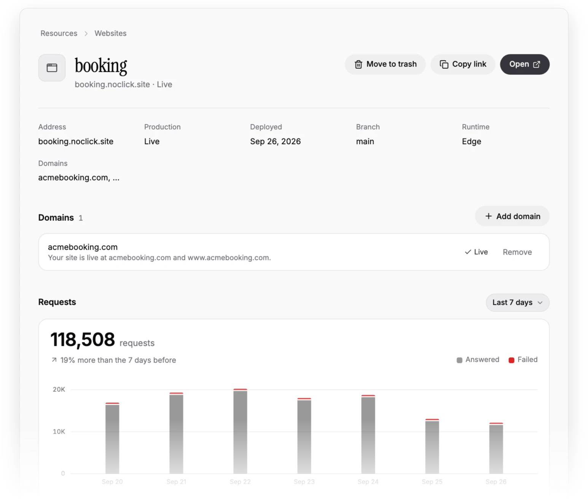

<p align="center">
  <picture>
    <source media="(prefers-color-scheme: dark)" srcset="docs/assets/title-dark.svg">
    
  </picture>
</p>

<p align="center">Your product acts for its own users: each of them gets hosted agents with their own inboxes, phone numbers and sandboxes, working in the accounts they connected and asking a person before anything risky. This repository is NoClick's SDKs for Python and TypeScript, both published as <code>noclick</code>, and the app built on them.</p>

<p align="center">
  <picture>
    <source media="(prefers-color-scheme: dark)" srcset="docs/assets/hero-dark.svg">
    
  </picture>
</p>

Every call in the loop is the Python SDK as this repository has it, and the connect page and the approval page are drawn after the ones NoClick shows a person. The bakery, its people and the product called Acme are made up.

- **A number an agent answers.** `PhoneNumber.from_name(..., create_if_missing=True)` buys it, and `answer_with(agent)` sends its calls to the agent. [Phone numbers](https://noclick.com/docs/guide/phone-numbers)
- **An account your user connects.** `Connection.from_name(..., create_if_missing=True, send_to="user")` sends them a page under your product's name, `wait()` returns once they have connected, and an agent with the connection in its `tools` works in their account. [Connections](https://noclick.com/docs/guide/connections)
- **A yes from a person.** `Human().approve(message, details=...)` sends them a page to answer on, and `.wait()` gives you `True` or `False`. [Asking people](https://noclick.com/docs/guide/humans)

## More of it, a few lines at a time

<p align="center">
  <picture>
    <source media="(prefers-color-scheme: dark)" srcset="docs/assets/tour-inbox-dark.svg">
    
  </picture>
  <picture>
    <source media="(prefers-color-scheme: dark)" srcset="docs/assets/tour-schedule-dark.svg">
    
  </picture>
</p>
<p align="center">
  <picture>
    <source media="(prefers-color-scheme: dark)" srcset="docs/assets/tour-cap-dark.svg">
    
  </picture>
  <picture>
    <source media="(prefers-color-scheme: dark)" srcset="docs/assets/tour-deploy-dark.svg">
    
  </picture>
</p>

The same made-up bakery and the same SDK, and under each snippet a page drawn after the one that shows it in NoClick. What the refused call prints is the [Spend](https://noclick.com/docs/guide/spend) guide's own example, and the estimate is what `noclick.estimate` answers for those three items today, each priced at what it costs NoClick with nothing added.

- **An inbox an agent answers.** `Inbox.from_name(..., create_if_missing=True, agent=agent)` opens an address, and each message that arrives wakes the agent, which replies on the thread. [Inboxes](https://noclick.com/docs/guide/inboxes)
- **A schedule that wakes an agent.** `noclick.Cron("0 8 * * 1-5", tz="Europe/London", message=...)` among an agent's `triggers` starts a turn each time it fires. [Triggers](https://noclick.com/docs/guide/triggers)
- **A cap that stops the spend.** `spend_cap_usd_per_month` on a user is checked before work starts; once it is used up, a call raises `noclick.SpendCapExceeded`, which names its `scope`, `spent` and `cap`. [Spend](https://noclick.com/docs/guide/spend)
- **A price first, then a live app.** `noclick.estimate([...])` answers each charge and the month's total, and makes nothing. `Repo.create(name, from_url=...)` copies a public repository, `Project.create(name, repo=repo)` makes it an app, and `deploy()` puts it live. [Apps and deployments](https://noclick.com/docs/guide/apps)

The SDK has the rest in the same shape: [sandboxes](https://noclick.com/docs/guide/sandboxes) and [browsers](https://noclick.com/docs/guide/browser) an agent works in, [channels](https://noclick.com/docs/guide/channels) where agents hand work to each other, [hosted MCP servers](https://noclick.com/docs/guide/mcp-servers), [queues](https://noclick.com/docs/guide/queues), [databases](https://noclick.com/docs/guide/databases) and [storage](https://noclick.com/docs/guide/storage).

## Start with one agent

You need a platform key with the scopes you use, in `NOCLICK_API_KEY`: the [developer console](https://noclick.com/dashboard/developers)'s API keys page makes one.

```bash
pip install noclick        # Python 3.10+
npm install noclick        # Node 20+, Bun, Deno, Cloudflare Workers
```

```python
import noclick

researcher = noclick.Agent.from_name(
    "researcher",
    create_if_missing=True,
    instructions="You research software vendors. Cite the pages you read.",
    tools=["exa.search"],
)
reply = researcher.message("What does Postmark charge for 100,000 emails a month?")
print(reply.text)
```

```ts
import { Agent } from "noclick";

const researcher = Agent.fromName("researcher", {
  createIfMissing: true,
  instructions: "You research software vendors. Cite the pages you read.",
  tools: ["exa.search"],
});
const reply = await researcher.message("What does Postmark charge for 100,000 emails a month?");
console.log(reply.text);
```

Each SDK's README has the full tour ([Python](sdk/python/README.md), [TypeScript](sdk/typescript/README.md)), [`sdk/examples`](sdk/examples) has complete programs, and the docs are at [noclick.com/docs](https://noclick.com/docs).

## The app, built on the same SDK

[`app`](app) is NoClick's own app, and it reaches NoClick only through the TypeScript SDK here. Run it with a NoClick key and it signs you in with a password of your own, keeps the key on its server, and opens on your account. That much is in this repository today:

<p align="center">
  
</p>

NoClick's screens are moving into it one at a time, the developer console first. These are that console and an app's page in Resources as they run on the SDK now, over sample data.

**Every agent: what it uses, and what it has spent.**

<p align="center">
  <picture>
    <source media="(prefers-color-scheme: dark)" srcset="docs/assets/console-dark.webp">
    
  </picture>
</p>

**Every run: what ran, what waited for a person, what a spending cap stopped.**

<p align="center">
  <picture>
    <source media="(prefers-color-scheme: dark)" srcset="docs/assets/runs-dark.webp">
    
  </picture>
</p>

**An app live at its own address, with its domains and its requests.**

<p align="center">
  <picture>
    <source media="(prefers-color-scheme: dark)" srcset="docs/assets/website-dark.webp">
    
  </picture>
</p>

## What is here

| Path | What it is |
| --- | --- |
| `sdk/python` | The Python SDK (Python 3.10+) |
| `sdk/typescript` | The TypeScript SDK (Node 20+, Bun, Deno, Cloudflare Workers), and `noclick/embed`, the bridge custom interface components use |
| `sdk/examples` | Complete programs on the Python SDK, each also a page at [noclick.com/docs/examples](https://noclick.com/docs/examples) |
| `app` | NoClick's app, built only on the TypeScript SDK: a React Router project that so far signs its owner in, keeps the NoClick key on its server and shows the account ([app/README.md](app/README.md)) |
| `plugins/noclick` | The Claude Code plugin for NoClick's hosted MCP server (`/plugin marketplace add noclickapp/noclick`); `.claude-plugin/marketplace.json` lists it |
| `glama.json` | This repository's listing in the Glama MCP directory |
| `docs/assets` | The pictures in this README; its `NOTICE.md` credits the icons and typefaces in them |
| `scripts/check.sh` | Builds and tests everything here, as CI does |

`scripts/check.sh` needs `python3`, Node 22.12 or later and pnpm 10 (`corepack enable pnpm`); CI runs it on
Python 3.12 and Node 22.

## Licence

Apache-2.0: see [LICENSE](LICENSE). Contributions are welcome ([CONTRIBUTING.md](CONTRIBUTING.md));
report a vulnerability as [SECURITY.md](SECURITY.md) says.
